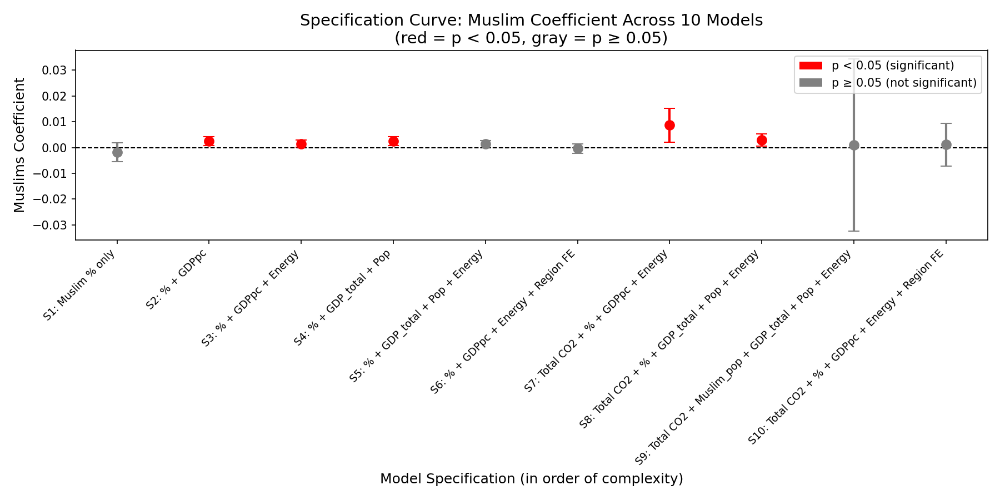

# Religion-Environment Gap Analysis

## Can religious composition explain environmental outcomes?

This project investigates whether Muslim population share predicts CO₂ emissions across 156 countries after accounting for economic development, energy consumption, and regional structures.

Using **specification curve analysis** and robustness testing, this study evaluates whether the observed relationship is consistent across alternative model specifications.

---

## Main Finding

> The observed association between Muslim population share and CO₂ emissions is highly specification-dependent. After introducing regional fixed effects, the relationship becomes statistically indistinguishable from zero, suggesting that broader structural factors are more important explanations of cross-national environmental differences.

---

## Research Design
Religious Composition
(Muslim Share)
|
|
↓
Observed Cross-National
CO₂ Association
|

| | |
↓ ↓ ↓
Economic Structure Energy System Region
(GDP, Development) (Consumption) (Geography)
| | |

|
↓
Environmental Outcome
(CO₂ Emissions)

Research Question:
Does the association remain after accounting
for structural factors?

---

## Key Results

### Specification Curve Analysis



*Red points indicate p < 0.05 (statistically significant). Gray points indicate p ≥ 0.05 (not significant). Error bars show 95% confidence intervals.*

### Regression Summary

| Model | Specification | Muslim Coef | p-value | R² |
|-------|--------------|-------------|---------|-----|
| S1 | Muslim only | -0.0019 | 0.313 | 0.007 |
| S2 | + GDP per capita | 0.0025 | 0.004 | 0.785 |
| S3 | + GDPpc + Energy | 0.0015 | **0.039** | 0.841 |
| S4 | + GDP + Pop | 0.0025 | 0.004 | 0.785 |
| S5 | + GDP + Pop + Energy | 0.0014 | 0.055 | 0.843 |
| **S6** | **+ Region FE** | **-0.0003** | **0.711** | **0.855** |
| S7 | Total CO2 + GDPpc + Energy | 0.0087 | 0.010 | 0.335 |
| **S8** | **Total CO2 + GDP + Pop + Energy** | **0.0029** | **0.018** | **0.930** |
| **S9** | **Muslim_pop (absolute)** | **0.0010** | **0.955** | **0.927** |
| S10 | Total CO2 + Region FE | 0.0011 | 0.794 | 0.492 |

### Robustness Checks

| Check | Result |
|-------|--------|
| Oil-exporting status | Muslims p: 0.039 → 0.083 |
| Clustered SE (Region, N=6) | HC3 p: 0.055 → Cluster p: 0.037 |

---

## Motivation

Environmental outcomes are often discussed in relation to cultural and religious differences. However, cross-national comparisons risk confusing cultural composition with economic development, geography, and energy structures.

This project investigates whether the observed relationship between religious composition and CO₂ emissions remains after systematically controlling for these structural factors.

---

## Technical Stack

### Programming
- Python
- Pandas
- NumPy
- Statsmodels
- Matplotlib

### Statistical Methods
- Ordinary Least Squares Regression
- Robust Standard Errors (HC3)
- Clustered Standard Errors
- Fixed Effects Models
- Specification Curve Analysis

### Data Sources
- Pew Research Center
- World Bank Development Indicators
- Environmental Performance Index

### Research Practices
- Reproducible analysis pipeline
- Version control with Git
- Transparent robustness evaluation

---

## How to Reproduce

```bash
# 1. Clone the repository
git clone https://github.com/yubi-26/religion-environment-gap-analysis.git
cd religion-environment-gap-analysis

# 2. Install dependencies
pip install -r requirements.txt

# 3. Run analysis
python src/05_specification_curve_analysis.py

# 4. Run robustness checks
python src/06_robustness_checks.py
Repository Structure
├── data/
│   ├── raw/              # Original data
│   └── processed/        # Cleaned data
├── src/
│   ├── 01_data_loader.py
│   ├── ...
│   ├── 05_specification_curve_analysis.py
│   └── 06_robustness_checks.py
├── outputs/
│   ├── tables/           # Results tables
│   └── figures/          # Figures
├── paper/
│   └── paper_draft.md    # Paper draft
├── research_notes.md     # Research notes
├── data_dictionary.md    # Variable descriptions
└── README.md             # This file
Limitations
Cross-sectional data → no causal inference

Muslim share is not religious intensity

Only 6 region clusters for clustered SE (use caution)

Limited to 156 countries

License
MIT

---

# 📄 paper/paper_draft.md（完全版）

```markdown
# Religious Composition and Environmental Outcomes:
## A Specification Curve Analysis of Religion, Economic Structure, and CO₂ Emissions

---

# Abstract

This study investigates the relationship between religious composition and CO₂ emissions using cross-national data from 156 countries in 2020. Specifically, we examine whether Muslim population share is associated with national CO₂ emissions after controlling for economic development, demographic structure, energy consumption, and regional characteristics.

Rather than relying on a single regression specification, we employ a **specification curve analysis** across ten model specifications. The results reveal substantial sensitivity of the estimated relationship to model choice. Positive associations between Muslim population share and CO₂ emissions appear in several specifications controlling for GDP and energy consumption (p < 0.05). However, the association becomes statistically insignificant when regional fixed effects are introduced (p = 0.711). Furthermore, measurement choice substantially affects inference: Muslim population share remains significant in one specification (p = 0.018), whereas absolute Muslim population size is not significant (p = 0.955).

Additional robustness analyses show that controlling for oil-exporting status reduces the magnitude and significance of the Muslim population coefficient, suggesting that energy-based economic structures partially contribute to the observed relationship. Clustered standard errors by region produce somewhat stronger statistical significance, although this result should be interpreted cautiously due to the limited number of clusters.

> **These findings suggest that the observed association is largely explained by regional economic, demographic, and energy structures rather than providing evidence of a direct causal effect of religious composition.**

---

# 1. Introduction

Climate change is one of the most pressing global challenges, with CO₂ emissions as a primary driver. Understanding the determinants of cross-national variation in emissions is critical for designing effective environmental policies. While economic development and energy consumption are well-established predictors, the role of cultural and religious factors remains debated.

Some scholars argue that religious values shape environmental attitudes and behaviors (e.g., stewardship ethics, views on nature). Others contend that economic and institutional structures are more important than cultural factors. However, empirical evidence on the relationship between religious composition and environmental outcomes is limited and often suffers from omitted variable bias.

This study addresses this gap by examining whether Muslim population share predicts CO₂ emissions after controlling for economic, demographic, and regional factors. We employ specification curve analysis—a systematic approach that estimates models across all reasonable specifications—to assess the robustness of the relationship.

---

## Research Question

> Does Muslim population share predict CO₂ emissions after controlling for economic development, demographic structure, energy consumption, and regional characteristics?

---

# 2. Data and Methods

## 2.1 Data

This study combines cross-national datasets from multiple sources:

- **Religious composition**: Pew Research Center global religious composition estimates
- **Economic and demographic indicators**: World Bank indicators
- **Environmental indicators**: Environmental Performance Index (EPI), CO₂ emissions data

The final dataset contains:
- 156 countries
- Year: 2020

---

## 2.2 Variables

### Dependent Variables

Two environmental outcomes are examined:

**Model group 1:** Log CO₂ emissions per capita
log(CO₂ / population)

**Model group 2:** Log total CO₂ emissions
log(CO₂)


The second specification group tests whether results are driven by national emission scale rather than individual environmental impact.

---

### Main Independent Variable

**Muslim population share:** Percentage of population identifying as Muslim.

This variable captures religious composition rather than individual religious behavior or intensity.

---

### Alternative Measurement

To test measurement sensitivity:

**Muslim population size:** Absolute number of Muslim residents.

This distinction allows examination of whether results reflect religious composition or simply population scale.

---

### Control Variables

| Category | Variables |
|----------|-----------|
| Economic | log GDP per capita, log total GDP |
| Demographic | log population |
| Energy | energy consumption per capita |
| Structural | oil-exporting status |
| Fixed Effects | regional fixed effects |

---

## 2.3 Specification Curve Design

Ten regression specifications were estimated.

| Model | Dependent | Muslim Var | Controls | Purpose |
|-------|-----------|------------|----------|---------|
| S1 | CO₂ per capita | Share | None | Baseline association |
| S2 | CO₂ per capita | Share | GDP per capita | Economic adjustment |
| S3 | CO₂ per capita | Share | GDPpc + Energy | Energy adjustment |
| S4 | CO₂ per capita | Share | GDP + Population | Scale adjustment |
| S5 | CO₂ per capita | Share | GDP + Pop + Energy | Full controls |
| **S6** | **CO₂ per capita** | **Share** | **GDPpc + Energy + Region FE** | **Regional structure** |
| S7 | Total CO₂ | Share | GDPpc + Energy | Emission scale |
| **S8** | **Total CO₂** | **Share** | **GDP + Pop + Energy** | **Full scale controls** |
| **S9** | **Total CO₂** | **Absolute Muslim pop** | **GDP + Pop + Energy** | **Measurement test** |
| S10 | Total CO₂ | Share | GDPpc + Energy + Region FE | Regional robustness |

---

# 3. Results

## 3.1 Specification Curve Analysis

Figure 1 presents the estimated Muslim population coefficient across ten specifications.

The coefficients range from:
-0.0019 to +0.0087


Among the ten specifications:
- Significant: 5 models
- Non-significant: 5 models

The estimated relationship is therefore **highly sensitive to model design**.

---

## 3.2 Effect of Regional Fixed Effects

The most important change occurs when regional fixed effects are introduced.

| Model | Muslim coefficient | p-value |
|-------|-------------------|---------|
| S3 (GDPpc + Energy) | 0.0015 | **0.039** |
| **S6 (+ Region FE)** | **-0.0003** | **0.711** |

After accounting for regional differences, the association disappears.

This indicates that regional characteristics explain a substantial portion of the observed relationship. However, regional fixed effects may also absorb mechanisms through which religion and historical development interact with environmental outcomes. Therefore, the result should be interpreted as evidence against a simple independent cross-national religious effect rather than definitive proof of no religious influence.

---

## 3.3 Measurement Sensitivity: Share vs Population Size

A major finding is that measurement choice changes the conclusion.

| Model | Muslim Variable | p-value |
|-------|-----------------|---------|
| **S8** | Muslim population **share** | **0.018** ✅ |
| **S9** | Absolute Muslim population **count** | **0.955** ❌ |

Although the share measure remains significant, population size does not.

This suggests that the relationship is not simply driven by the absolute number of Muslims, but by how religious composition is distributed across countries.

---

## 3.4 Oil-Exporting Status

Oil-exporting status was examined as a potential mechanism.

| Model | Muslims coefficient |
|-------|-------------------|
| Without oil control | p = 0.039 |
| With oil control | p = 0.083 |

Adding oil-exporting status reduces the coefficient magnitude:
0.0015 → 0.0012

This suggests that energy-based economic structures partially contribute to the observed association.

However, oil-exporting status itself is not statistically significant:
p = 0.339


Therefore, oil dependence alone cannot fully explain the relationship.

---

## 3.5 Clustered Standard Errors

To account for possible correlation among countries within the same region:

| Standard Error | p-value |
|----------------|---------|
| HC3 robust SE | 0.055 |
| Region clustered SE | 0.037 |

The estimated relationship becomes statistically significant under clustered inference.

> **However, interpretation requires caution because the analysis contains only six regional clusters, which limits reliability of cluster-based inference. Therefore, clustered standard errors are treated as a robustness check rather than the primary inference strategy.**

---

# 4. Discussion

## 4.1 Main Interpretation

The evidence does not support a simple interpretation that religious composition directly determines environmental outcomes.

Instead, the relationship between Muslim population share and CO₂ emissions appears to depend strongly on:

1. Regional structure
2. Economic development patterns
3. Energy systems
4. Variable measurement choices

The disappearance of significance after regional fixed effects suggests that geographical and structural factors are central explanations.

---

## 4.2 Contribution

This study contributes in three ways.

**First,** it demonstrates the importance of specification uncertainty. A single regression model can produce misleading conclusions when alternative reasonable specifications produce different results.

**Second,** it highlights measurement sensitivity. Using religious share and absolute population size leads to different conclusions.

**Third,** it provides a more cautious framework for studying cultural-environmental relationships. Rather than asking:

> Does religion cause environmental outcomes?

A more appropriate question may be:

> Under what economic and institutional conditions do religious compositions become associated with environmental outcomes?

---

## 4.3 Limitations

This study has several limitations.

**Cross-sectional design:** Because the analysis uses data from one year, causal inference is not possible. The results identify statistical associations rather than causal effects.

**Religious measurement:** Muslim population share captures demographic composition, not religious beliefs, environmental attitudes, or individual behavior.

**Regional fixed effects:** Region fixed effects remove substantial regional variation but may also absorb historically meaningful pathways linking culture, institutions, and development.

**Cluster inference:** Only six regional clusters are available, requiring cautious interpretation of clustered standard errors.

---

# 5. Conclusion

This study examined whether Muslim population share predicts CO₂ emissions using specification curve analysis across ten model specifications.

The results show that the relationship is **highly specification-dependent**. Positive associations appear in several models controlling for GDP and energy consumption. However, these associations disappear when regional fixed effects are introduced. Furthermore, changing the measurement of Muslim population from share to absolute population size substantially changes statistical inference.

> **Overall, the findings suggest that observed relationships between religious composition and CO₂ emissions are strongly intertwined with regional economic, demographic, and energy structures. These results caution against attributing environmental outcomes directly to religious composition without considering broader structural contexts.**

The study demonstrates that specification transparency and robustness analysis are essential when examining complex relationships between culture and environmental outcomes.

---

# References

1. World Bank. (2020). *World Development Indicators*. Washington, DC: World Bank Group.

2. Pew Research Center. (2020). *Religious Composition by Country, 2010-2050*. Washington, DC: Pew Research Center.

3. Wendling, Z. A., Emerson, J. W., de Sherbinin, A., & Esty, D. C. (2020). *2020 Environmental Performance Index*. New Haven, CT: Yale Center for Environmental Law & Policy.

4. Sachs, J. D., & Warner, A. M. (2001). The curse of natural resources. *European Economic Review*, 45(4-6), 827-838.

5. Inglehart, R., & Baker, W. E. (2000). Modernization, cultural change, and the persistence of traditional values. *American Sociological Review*, 65(1), 19-51.

6. Franzen, A., & Vogl, D. (2013). Two decades of measuring environmental attitudes: A comparative analysis of 33 countries. *Global Environmental Change*, 23(5), 1001-1008.

7. Givens, J. E., & Jorgenson, A. K. (2013). Individual environmental concern in the world polity: A multilevel analysis. *Social Science Research*, 42(2), 418-431.

---

# Tables and Figures

## Table 1. Regression Results

| Model | Muslim Coef | p-value | R² | Significant? |
|-------|-------------|---------|-----|--------------|
| S1 | -0.0019 | 0.313 | 0.007 | ❌ |
| S2 | 0.0025 | 0.004 | 0.785 | ✅ |
| S3 | 0.0015 | 0.039 | 0.841 | ✅ |
| S4 | 0.0025 | 0.004 | 0.785 | ✅ |
| S5 | 0.0014 | 0.055 | 0.843 | ❌ |
| **S6** | **-0.0003** | **0.711** | **0.855** | **❌** |
| S7 | 0.0087 | 0.010 | 0.335 | ✅ |
| **S8** | **0.0029** | **0.018** | **0.930** | **✅** |
| **S9** | **0.0010** | **0.955** | **0.927** | **❌** |
| S10 | 0.0011 | 0.794 | 0.492 | ❌ |

---

## Figure 1. Specification Curve


*Note: Red points indicate p < 0.05 (statistically significant). Gray points indicate p ≥ 0.05 (not significant). Error bars show 95% confidence intervals.*
📄 requirements.txt
pandas>=1.5.0
numpy>=1.23.0
statsmodels>=0.13.0
matplotlib>=3.5.0
scipy>=1.9.0
scikit-learn>=1.0.0
jupyter>=1.0.0
📄 LICENSE（MIT）
MIT License

Copyright (c) 2026

Permission is hereby granted, free of charge, to any person obtaining a copy
of this software and associated documentation files (the "Software"), to deal
in the Software without restriction, including without limitation the rights
to use, copy, modify, merge, publish, distribute, sublicense, and/or sell
copies of the Software, and to permit persons to whom the Software is
furnished to do so, subject to the following conditions:

The above copyright notice and this permission notice shall be included in all
copies or substantial portions of the Software.

THE SOFTWARE IS PROVIDED "AS IS", WITHOUT WARRANTY OF ANY KIND, EXPRESS OR
IMPLIED, INCLUDING BUT NOT LIMITED TO THE WARRANTIES OF MERCHANTABILITY,
FITNESS FOR A PARTICULAR PURPOSE AND NONINFRINGEMENT. IN NO EVENT SHALL THE
AUTHORS OR COPYRIGHT HOLDERS BE LIABLE FOR ANY CLAIM, DAMAGES OR OTHER
LIABILITY, WHETHER IN AN ACTION OF CONTRACT, TORT OR OTHERWISE, ARISING FROM,
OUT OF OR IN CONNECTION WITH THE SOFTWARE OR THE USE OR OTHER DEALINGS IN THE
SOFTWARE.
📄 data_dictionary.md
# Data Dictionary

## Environmental Variables (EPI)

| Variable | Meaning | Source |
|----------|---------|--------|
| epi_score | Environmental Performance Index score | EPI 2020 |
| biodiversity_habitat | Biodiversity and Habitat index | EPI 2020 |
| species_habitat | Species Habitat index | EPI 2020 |
| species_protection | Species Protection Index | EPI 2020 |

### Important Note
**RLI = Red List Index (biodiversity indicator), NOT Rule of Law**

---

## Social Variables

| Variable | Meaning | Source |
|----------|---------|--------|
| Muslims | Muslim population share (%) | Pew Research Center |
| gdp | GDP (current USD) | World Bank |
| population | Total population | World Bank |
| energy_per_capita | Energy consumption per capita | World Bank |

---

## Dependent Variables

| Variable | Calculation | Source |
|----------|-------------|--------|
| log_co2_per_capita | log(CO₂ / population) | Our World in Data / World Bank |
| log_total_co2 | log(total CO₂ emissions) | Our World in Data / World Bank |

---

## Derived Variables

| Variable | Calculation | Purpose |
|----------|-------------|---------|
| log_gdp_per_capita | log(GDP / population) | Economic development measure |
| log_population | log(population + 1) | Demographic scale |
| energy_per_capita_scaled | energy_per_capita / 1000 | Scaled for interpretability |
| log_muslim_population | log((Muslims/100) × population + 1) | Absolute Muslim population |
| oil_exporter | Binary flag | Oil-exporting status |